# PsExec Lateral Movement — Detection & Response Case Study

**Author:** Norbert Adelin Fratutiu
**Lab environment:** Home SOC Lab (VirtualBox — pfSense, Splunk Enterprise, Windows 10 target, Kali Linux attacker)
**Date:** August 2026

---

## 1. Objective

Simulate a real-world lateral movement technique (PsExec-style remote service execution over SMB) against a segmented lab environment, and validate detection coverage across host telemetry (Sysmon), Windows event logs, endpoint AV, and SIEM correlation/alerting in Splunk.

This exercise was designed to answer three practical questions:

- Can this attack technique be executed successfully in a realistic, segmented network?
- What telemetry does it generate, and is that telemetry actually reaching the SIEM?
- Can a detection rule be built that would catch this technique in near real time?

---

## 2. Lab Environment

| Component | Details |
|---|---|
| Firewall / Segmentation | pfSense — LAN (192.168.10.0/24), isolated management network OPT1 (192.168.20.0/24) |
| SIEM | Splunk Enterprise on Ubuntu |
| Target host | Windows 10 ("Windows10-Sandb"), Sysmon installed, Splunk Universal Forwarder installed |
| Attacker host | Kali Linux |
| Endpoint telemetry | Sysmon (process creation, file creation, network connection events) forwarded to Splunk |
| Endpoint protection | Windows Defender (default configuration) |

All hosts are contained within an isolated VirtualBox lab network with no route to production or external systems.

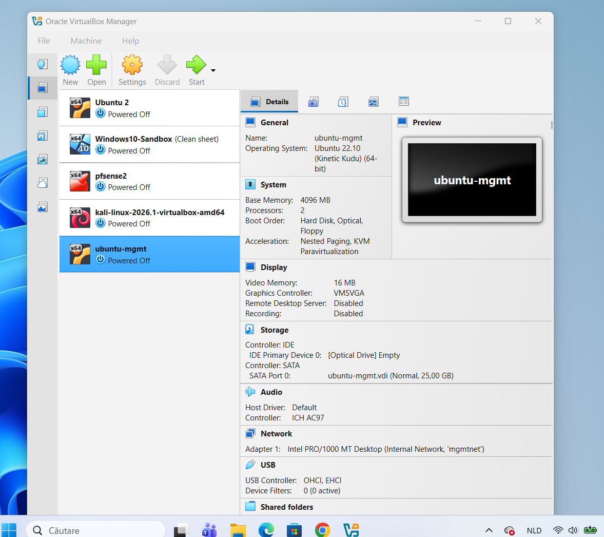

---

## 3. Attack Narrative

### 3.1 Reconnaissance

An initial port scan against the target's SMB service returned a `filtered` state on port 445 — indicating the connection was being silently dropped rather than actively refused.

```bash
nmap -Pn -p 445 192.168.10.101
```

```
PORT    STATE    SERVICE
445/tcp filtered microsoft-ds
```

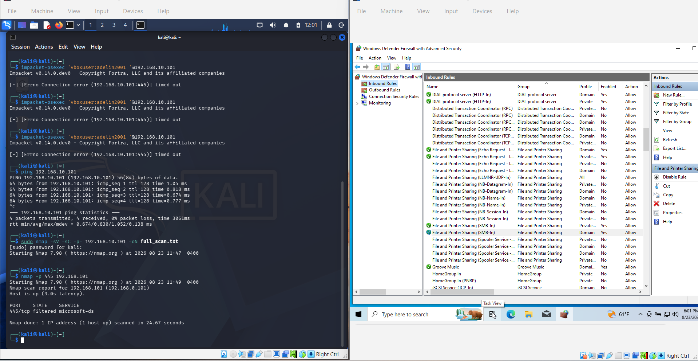

### 3.2 Root Cause: Host Firewall Profile

Investigation on the target host revealed the network adapter was classified under the **Public** connection profile in Windows. By default, Windows blocks inbound File and Printer Sharing (SMB) traffic on the Public profile, regardless of whether the underlying firewall rule is enabled — this is expected, safe default behavior for a host on an untrusted network.

```powershell
Get-NetConnectionProfile
```

Since this host sits on an isolated, trusted internal lab segment, the profile was reclassified and the SMB-In rule explicitly enabled for the Domain/Private profiles:

```powershell
Set-NetConnectionProfile -NetworkCategory Private
Get-NetFirewallRule -DisplayGroup "File and Printer Sharing" | Set-NetFirewallRule -Profile Domain,Private -Enabled True
```

A repeat scan confirmed the port was now reachable:

```
PORT    STATE    SERVICE
445/tcp open     microsoft-ds
```

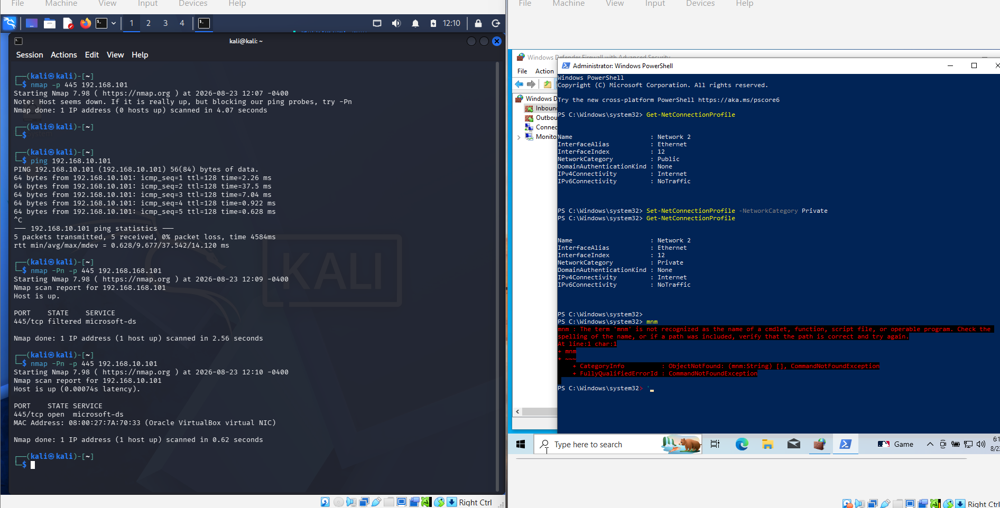

**Note:** This step is a realistic reflection of how host-based firewall posture directly affects attack surface — the same misconfiguration troubleshooting a defender would go through to *harden* a host also determines whether an attacker's lateral movement attempt succeeds.

### 3.3 Authentication & Authorization Barrier

An initial PsExec attempt using local credentials failed against the administrative shares, despite the account holding local administrator rights:

```
[-] share 'ADMIN$' is not writable.
[-] share 'C$' is not writable.
```

This is caused by **UAC Remote Restrictions**, which strip elevated token privileges from local (non-domain) accounts connecting over the network by default — a Windows security control designed specifically to reduce the impact of exactly this kind of attack.

For the purposes of this lab exercise, the restriction was disabled to allow the technique to proceed and generate telemetry:

```powershell
New-ItemProperty -Path HKLM:\SOFTWARE\Microsoft\Windows\CurrentVersion\Policies\System `
  -Name LocalAccountTokenFilterPolicy -Value 1 -PropertyType DWord -Force
```


### 3.4 Exploitation — PsExec Remote Execution

With the barrier removed, the PsExec-style attack was executed from Kali using Impacket:

```bash
impacket-psexec 'vboxuser:********'@192.168.10.101
```

```
[*] Requesting shares on 192.168.10.101.....
[*] Found writable share ADMIN$
[*] Uploading file ufHkjTiA.exe
[*] Opening SVCManager on 192.168.10.101.....
[*] Creating service MtlW on 192.168.10.101.....
[*] Starting service MtlW.....
```

This confirms a full remote-execution chain: file upload to an administrative share, service registration, and remote service execution — functionally equivalent to how many real-world lateral movement toolkits (and legitimate IT tools) operate.

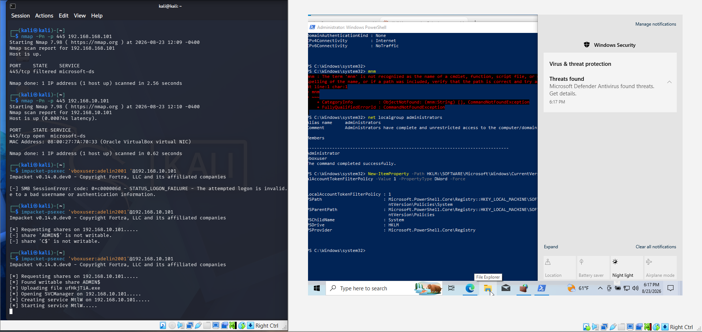

---

## 4. Detection Evidence

Every stage of the attack was independently corroborated in Splunk via Sysmon and native Windows event logs, demonstrating full-chain visibility rather than a single point of detection.

| Stage | Source | Event | Key Fields |
|---|---|---|---|
| Network connection | Sysmon | EventCode 3 | SMB session from Kali to target, port 445 |
| File delivery | Sysmon | EventCode 11 | `TargetFilename: C:\Windows\ufHkjTiA.exe`, `User: NT AUTHORITY\SYSTEM` |
| Service installation | Windows System log | EventCode 7045 | `Service Name: MtlW`, `Service File Name: %systemroot%\ufHkjTiA.exe`, `Service Account: LocalSystem` |
| Process execution | Sysmon | EventCode 1 | `ParentImage: C:\Windows\System32\services.exe`, `ParentUser: NT AUTHORITY\SYSTEM` |
| Endpoint AV | Windows Defender | — | `VirTool:Win32/RemoteExec` flagged as **Severe** |

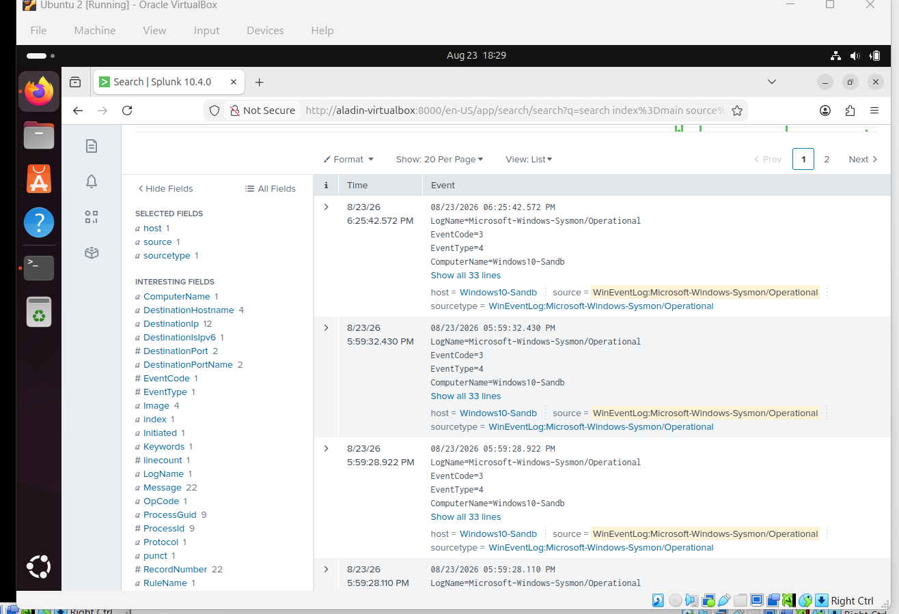
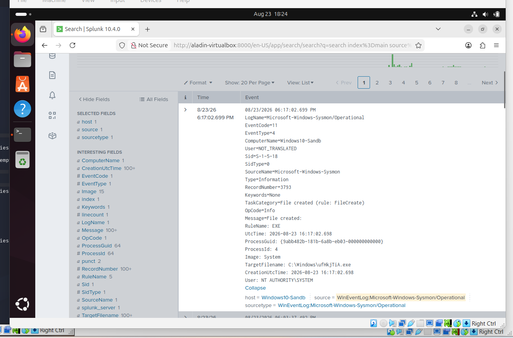
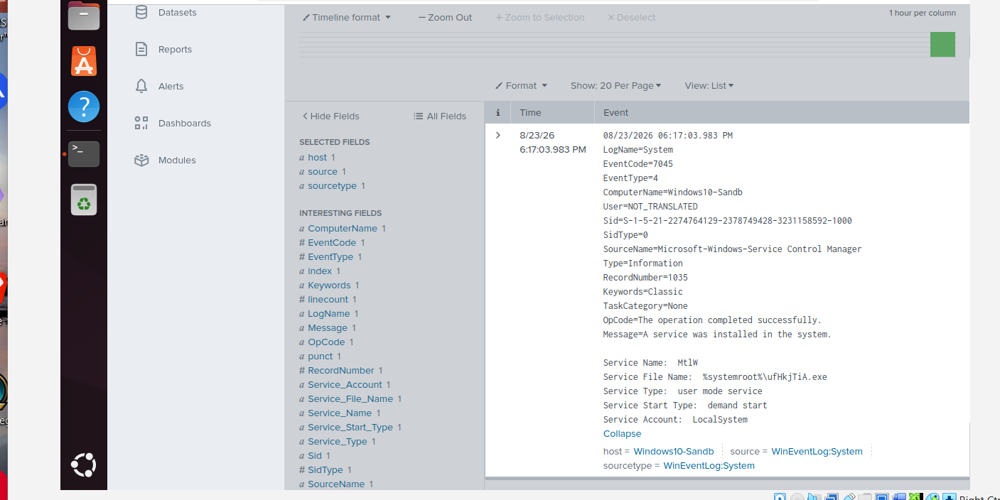
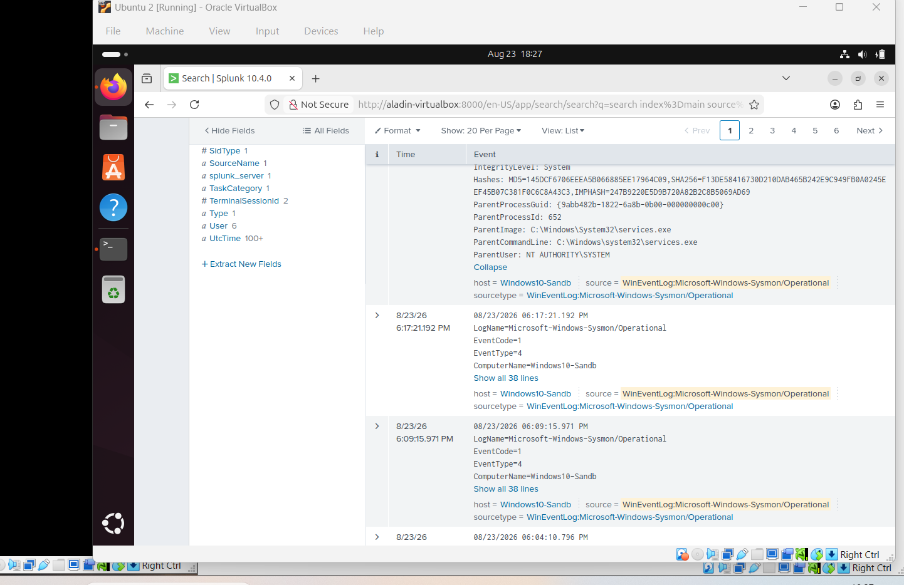
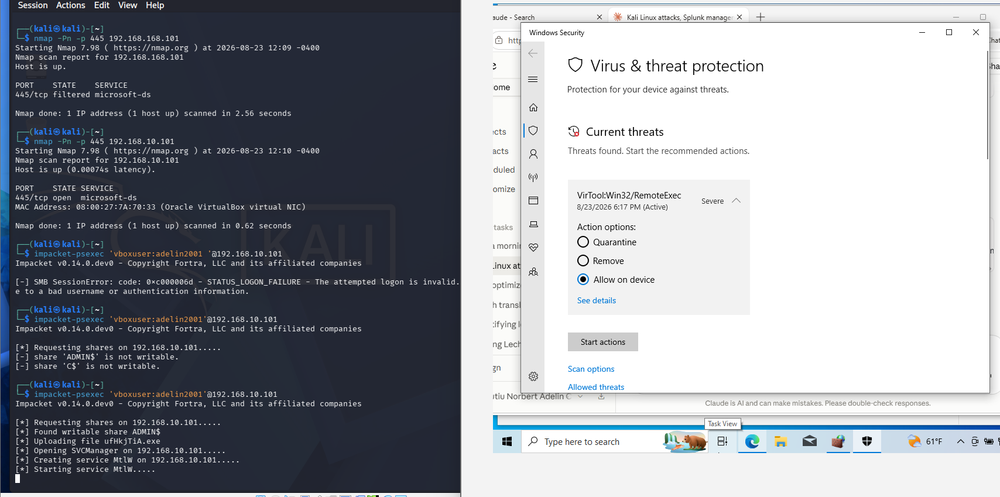

### 4.1 Why this matters

The combination of Event 11 (file drop) → Event 7045 (service registration referencing that exact file) → Event 1 (execution with `services.exe` as parent) forms an unbroken evidentiary chain. Individually, each event is only moderately suspicious; correlated together with matching filenames, timestamps, and the `services.exe` parent-child relationship, they form high-confidence evidence of remote service-based lateral movement — the same reasoning a Tier 1/2 SOC analyst would apply when triaging this alert chain in a real environment.

---

## 5. Detection Engineering — Splunk Alert

A correlation search was built and saved as a scheduled Splunk alert to detect this technique in near real time, rather than relying on manual log review after the fact.

**Search logic:**

```spl
index=main sourcetype="WinEventLog:Microsoft-Windows-Sysmon/Operational"
EventCode=1 ParentImage="*services.exe*" Image!="*svchost.exe*"
| table _time, ComputerName, User, Image, ParentImage, CommandLine
```

**Rationale:** Legitimate Windows services are almost exclusively spawned as `svchost.exe` or other well-known system binaries. A process created with `services.exe` as its direct parent, where the child is *not* a standard service host process, is a strong, low-noise indicator of PsExec-style remote service execution.

**Alert configuration:**

| Setting | Value |
|---|---|
| Type | Scheduled, every 5 minutes |
| Time range | Last 5 minutes |
| Trigger condition | Number of results > 0 |
| Trigger | Once per scheduled run |
| Action | Add to Triggered Alerts |

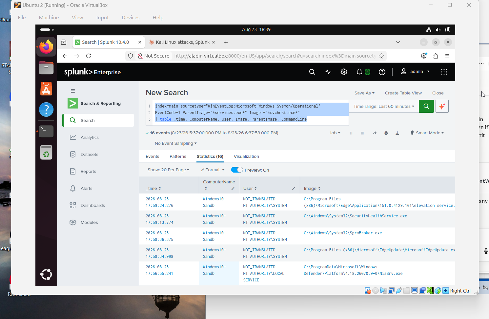
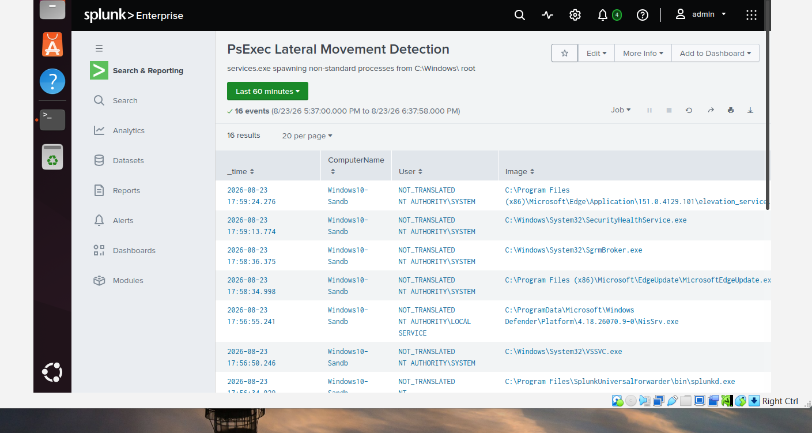

---

## 6. Recommended Response Actions

If this activity were observed in a production environment, the following response steps would apply:

1. **Isolate the affected host** from the network to prevent further lateral movement or data exfiltration.
2. **Disable or reset credentials** for the account used (`vboxuser` in this exercise) — local account compromise via SMB is a strong indicator of credential reuse or a prior compromise elsewhere.
3. **Hunt for persistence mechanisms** — scheduled tasks, registry Run keys, or additional services created around the same timestamp.
4. **Review UAC Remote Restrictions and firewall profile settings** across the environment — the two misconfigurations that enabled this attack (Public profile blocking SMB, then being reclassified; local account token filtering) should be assessed as a broader policy question, not fixed host-by-host.
5. **Validate the Splunk alert fires reliably** under normal operational load, and tune the search to exclude any legitimate internal tools that may also spawn processes from `services.exe`.

---

## 7. Summary

This exercise demonstrated a complete attack lifecycle — reconnaissance, a realistic troubleshooting path through host-based defenses, exploitation via PsExec-style remote execution, and full multi-source detection correlation across Sysmon, native Windows event logs, and endpoint AV — culminating in a working, scheduled Splunk detection rule.

The exercise reinforced that effective detection relies not on a single log source but on correlating multiple weak signals (file creation, service registration, process lineage) into a single high-confidence chain of evidence, and that detection engineering (turning an investigation into a repeatable alert) is a distinct and necessary step beyond simple log review.

---

## Appendix: Tools & References

- [Impacket](https://github.com/fortra/impacket) — `psexec.py`
- Sysmon (Sysinternals) — configured to log process creation (Event ID 1), file creation (Event ID 11), and network connections (Event ID 3)
- Splunk Enterprise 10.4.0
- MITRE ATT&CK mapping:
  - [T1021.002 — Remote Services: SMB/Windows Admin Shares](https://attack.mitre.org/techniques/T1021/002/)
  - [T1569.002 — System Services: Service Execution](https://attack.mitre.org/techniques/T1569/002/)
